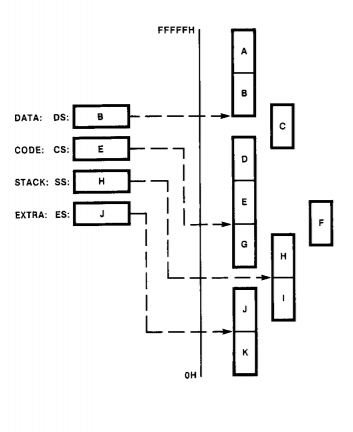
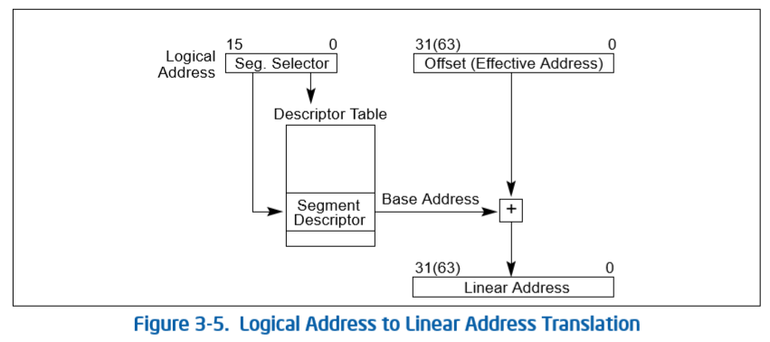
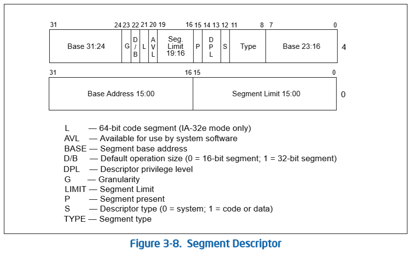
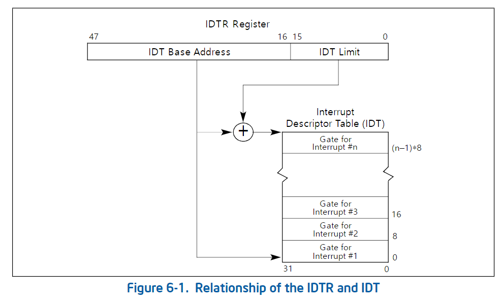
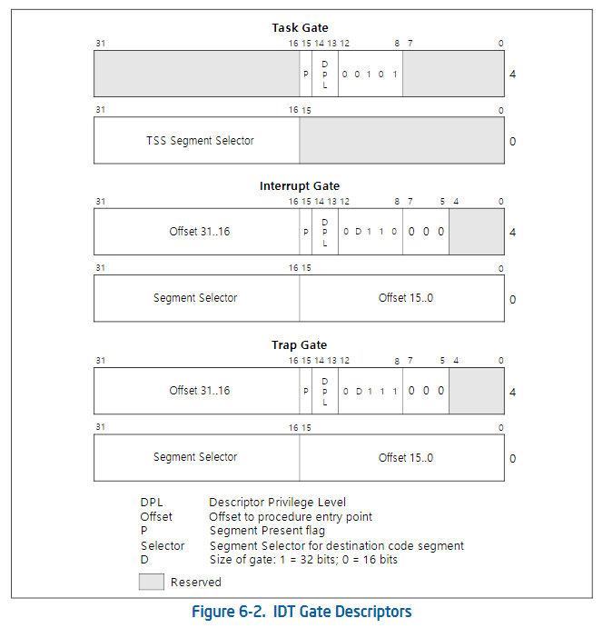
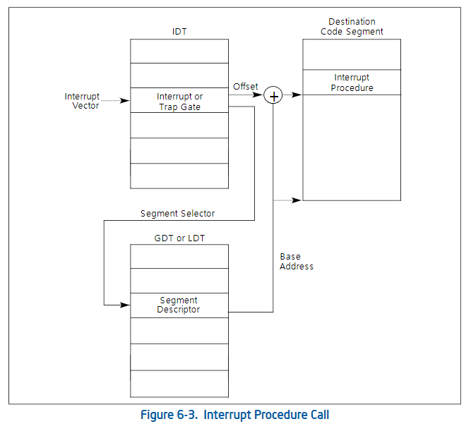
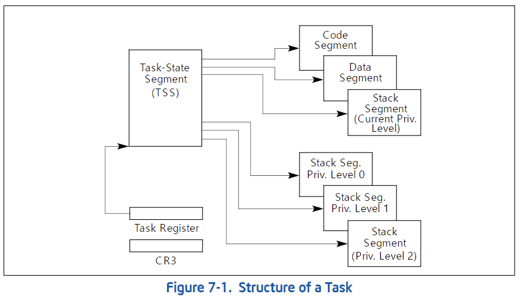
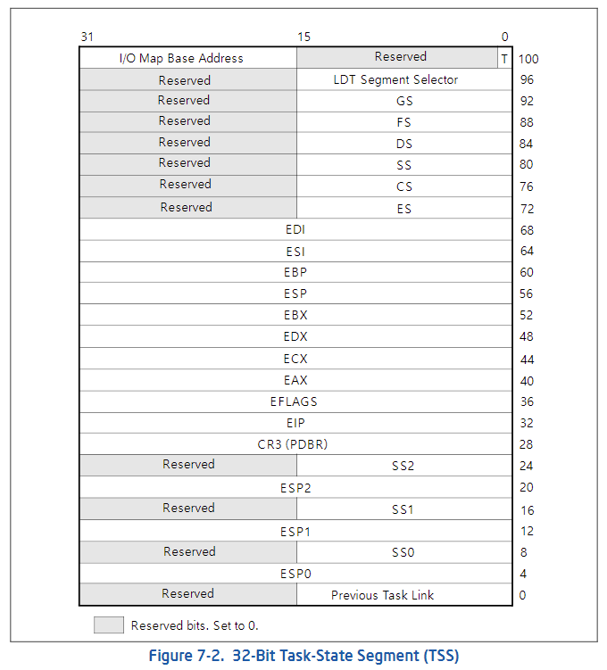

# Chpater 3. 프로세서 아키텍처

## 3.1 386 아키텍처

해당 챕터에서는 386 아키텍처에 대해서 다룰 것이다. 도입부에서 얘기했듯이 아키텍처의 모든 부분을 설명하지는 않고,  관련된 내용만 기술한다. 추가적인 부분은 아키텍쳐 매뉴얼을 참고하면 된다.  레지스터 세트, 명령어 세트 등과 같은 기본적인 것에 대한 설명을 피하고 0.01 코드 이해와 관련된 내용만 소개한다.

### 3.1.1 Segmentation in 386

**8086 모드**에서는 물리 메모리 공간은  64KB 크기의 세그먼트라는 논리적 메모리 공간으로 분리 된다. CPU는 4개의 세그먼트에 대해 직접적인 접근이 가능하다. 세그먼트들이 표현하는 영역은 겹쳐질 수도 있고 겹치지 않을 수  있다. 아래 그림은 각각의 세그먼트가 차지하고 있는 물리 주소 영역을 보여준다.

* CS\(code segment\)는 현재 코드 세그먼트의 베이스 주소를 저장한다. \(Instruction fetch될 때 코드 세그먼트를 사용해서 얻은 물리 주소의 인스트럭션을 읽어들인다.\)
* DS\(data segment\)는 현재 데이터 세그먼트 주소를 저장한다. 
* ES\(extra segment\)는 추가적인 세그먼트의 베이스 주소를 저장한다. 
* SS\(stack segment\)는 현재 스텍 세그먼트의 베이스 주소를 저장한다.

8086 모드에서는 두 개의 주소 영역\[논리적 주소\(Logical address\), 물리 주소\(Physical address\)\]가 있다고 생각하면 편하다. 물리적 주소는 최대 1MB까지 표현이 되고, 논리적 주소는 세그먼트의 주소 공간에 대응하므로 64KB까지 표현이 된다. 물리적 주소는 세그먼트 레지스터의 값을 16만큼 더하고, offset을 더하는 것으로 변환된다. 

위의 예시를 살펴보자. 접근하려는 논리적 주소는 0x0022이고 선택된 세그먼트의 베이스 어드레스는 0x1234와 같다 따라서 PHYSICAL\_ADDRESS = \(BASE\_ADDRESS &lt;&lt; 4\) + OFFSET과 같이 계산이 되어 0x12362의 주소로 변환된다.

**386 모드**에서는 세그먼트 레지스터는 8086모드에서와는 다르게 사용되고 이름도 세그먼트 셀렉터라고 불린다. 이름대로 세그먼트 셀렉터는 세그먼트 디스크립터 테이블의 한 엔트리를 가르킨다.

* Index : \[15:3\] 세그먼트 디스크립터 테이블의 인덱스를 의미한다. 
* Table Indicator: GDT\(Global Descriptor Table\)를 사용할지 LDT\(Local Descriptor Table\)을 사용할지 결정한다.
* Requested Privilege Level: 현재 프로세스/태스크의특권 레벨를 저장한다.\(\*매뉴얼의 Privilege 항목 참고\)

논리 주소가 선형 주소\(linear address\)로 변환되는 과정은 다음과 같다.

* 사용될 세그먼트 디스크립터를 세그먼트 셀렉터를 사용해서 고른다.
* 세그먼트 디스크립터의 접근할 권한이 있는지 확인하고 오프셋이 세그먼트의 디스크립터의 리미트를 벗어나는지 확인한다.
* 세그먼트 디스크립터의 베이스 어드레스와 오프셋을 더하여 선형 주소으로 변환한다.

#### 3.1.1.1 디스크립터 테이블

위의 내용을 잘 따라 왔다면 "프로세서는 세그먼트 디스크립터 테이블의 위치는 어떻게 알지?"라는 질문을 떠올리게 될 것이다. 세그먼트 디스크립터 테이블의 주소를 위한 특별한 레지스터들이 존재하고, GDTR\(gdt 레지스터\)는 GDT 자료 구조의 위치를 LDTR은 LDT 자료 구조의 위치를 저장한다. LGDT/LLDT , SGDT/SLDT 인스트럭션들은 프로세서가 세그먼트 디스크립터의 주소를 레지스터에 load, save하도록 한다.

#### 3.1.1.2 GDT/LDT 디스크립터 포맷

아래 그림은 모든 디스크립터에 대해, 일반적인 디스크립터 포맷을 보여준다.

* Segment Limit: 세그먼트의 크기 정보를 담는다. 해당 제한을 벗어난 오프셋에 대한 접근은 exception을 발생한다.
  * Granularity가 0이라면 기본 단위는 1B이다 
  * Granularity가 1이라면 기본 단위는 4KB이다.
  * ex\) limit = 0x0022 일때
    * Granularity=0 이라면, 세그먼트의 사이즈는 22바이트이다. 
    * Granularity=1 이라면, 세그먼트의 사이즈는 88킬로바이트이다.
* Base address fields: 0부터 4GB까지 세그먼트의 베이스 주소를 저장한다.
* Type: 해당 디스크립터가 Read/Write/Executable/Expand 속성을 저장한다. 

### 3.1.2 Paging in 386

### 3.1.3 Interrupt/Exception in 386

이제 386의 인터럽트와 예외에 대한 알아보도록 하자. 다만, 이 주제만으로도 책 한 권을 쓸 수있으므로 0.01 커널을 이해하는 데 필수적인 부분만 기술한다. 386의 인터럽트는 8086과 크게 다르지 않다. 외부 장치는 8259 PIC 또는 최신 APIC의 인터럽트 컨트롤러에 연결된다.

#### 3.1.3.1 Interrupt/Exception overview

인터럽트/예외는 프로세서에게 조치가 필요한 상황을 알리는 이벤트다. 일반적으로 현재 실행 중인 태스크에서, 인터럽트 핸들러 또는 예외 핸들러라고 하는 특수 소프트웨어 루틴 또는 태스크로 강제 전환된다. 프로세서가 인터럽트 또는 예외에 대응하여 취하는 조치를 서비스 또는 인터럽트 또는 예외 처리라고 한다.

예외와 인터럽트 처리를 위해, 프로세서에 의해 특별한 처리가 필요한 예외와 인터럽트는 벡터 번호라고 하는 고유한 식별 번호가 할당된다. 프로세서는 예외 또는 인터럽트에 할당된 벡터 번호를 IDT의 인덱스로 사용한다. 벡터 번호는 0~255번까지 존재하고

* 0~31번은 아키텍처에 의해 예약된 번호이다.
* 32~255번은 사용자 정의 인터럽트이다.

#### 3.1.3.2 IDT

IDT는 8바이트의 인터럽트 디스크립터의 배열이다. 아래 그림과 같이 프로세서는 IDTR 레지스터에 IDT의 위치를 저장한다. 이 레지스터는 IDT의 상위 32비트는 IDT의 주소를, 하위 16비트는 테이블 엔트리의 사이즈를 저장한다. LIDT\(Load IDT Register\)와 SIDT\(Store IDT Register\) 인스트럭션은 각각 IDTR 레지스터의 내용을 읽거나 저장한다. 

#### 3.1.3.3 IDT descriptor format

IDT는 세 가지 종류의 게이트 설명자를 포함할 수 있다.

* Task-gate descriptor
* Interrupt-gate descriptor
* Trap-gate descriptor

아래 그림은 **Task-gate, Interrupt-gate, Trap-gate**의 형식을 보여준다. 

작업 게이트에는 예외 및/또는 인터럽트 처리기 작업을 위한 TSS의 세그먼트 셀렉터가 포함되어 있다. **Interrupt-gate/Trap-Gate**에는 프로세서가 예외 또는 인터럽트 핸들러의 세그먼트 셀렉터와 오프셋이 포함되어 있다. 아래 그림은 세그먼트 셀렉터와 오프셋을 통해 핸들러의 위치를 얻는 과정을 보여준다.

모든 종류의 예외와 인터럽트를 처리하기 위해 0.01은 트랩 게이트를 사용한다. 트랩 게이트와 인터럽트 게이트의 차이점은 

* **Interrupt-gate**: 인터럽트 처리 중 인터럽트 플래그를 **비활성화**한다
* **Trap-gate**: 인터럽츠 처리 중 인터럽트 플래그에 변화가 없다.

### 3.1.4 Tasks in 386

태스크는 프로세서가 파견, 실행 및 일시 중단할 수 있는 작업의 단위다. 프로그램, 태스크 또는 프로세스, 운영 체제 서비스 유틸리티, 인터럽트 또는 예외 핸들러, 커널 또는 실행 유틸리티를 실행하는 데 사용할 수 있다. 386 아키텍처는 태스크의 상태를 저장하고, 준비된 태스크를 실행하고, 한 태스크에서 다른 태스크로 전환하는 메커니즘을 제공한다. \(현재 리눅스는 해당 하드웨어 메커니즘을 사용하지 않고 소프트웨어적으로 구현한다.\)

#### 3.1.4.1 Task Structure

태스크는 태스크 실행 공간\(task execution space\)와 태스크 상태 세그먼트\(TSS\)의 두 부분으로 구성된다. 태스크 실행 공간은 코드 세그먼트, 스택 세그먼트 및 하나 이상의 데이터 세그먼트로 구성된다. 운영 체제가 프로세서의 특권 레벨\(privilege-level\) 보호 메커니즘을 사용하는 경우, 태스크 실행 공간은 각 특권 레벨에 따라 다른 스택을 제공한다. TSS는 태스크 실행 공간을 구성하는 세그먼트를 지정하고 태스크 상태 정보를 저장할 공간을 제공한다. 태스크는 TSS에 의해 식별되어 멀티 태스킹 시스템을 쉽게 구현할 수 있다. 태스크를 실행하기 위해 프로세서에 로드하면 TSS의 세그먼트 셀렉터, 기본 주소, 한계 및 세그먼트 디스크립터 특성이 작업 레지스터에 로드된다. 

페이징이 활성화 되었다면, 태스크가 사용하는 페이지 디렉터리의 기본 주소가 제어 레지스터 CR3에 로드된다.

프로세서는 태스크가 중단되면 아래의 필드를 업데이트한다.

* **범용 레지스터 필드** — 태스크 스위치 이전의 EAX, ECX, EDX, EBX, ESP, ESI 및 EDI 레지스터
* **세그먼트 셀렉 필드** — ES, CS, SS, DS, FS 및 GS 레지스터
* **EFLAGS 레지스터 필드** — EFAGS 레지스터
* **EIP \(Instruction Pointer\) 필드** — EIP 레지스터
* **Previous task link 필드** — 이전 태스크의 TSS에 대한 세그먼트 셀렉터
* **LDT 세그먼트 셀렉 필드** — 태스크의 LDT에 대한 세그먼트 셀렉터
* **CR3 레지스터 필드** — 태스크에서 사용할 페이지 디렉터리의 기본 물리적 주소
* **특권 레벨 스택 포인터 필드** — 스택 세그먼트\(SS0, SS1, SS2\), 스택 포인터\(ESP0, ESP1, ESP2\)
* **I/O 맵 기본 주소 필드** —  I/O 맵 기본 주소

#### 3.1.4.2 Task switching

프로세서는 다음 네 가지 경우 중 하나로 실행을 다른 태스크로 전송한다. 

* 현재 프로그램, 작업 또는 절차는 GDT의 TSS 설명자에게 JMP 또는 CALL 명령을 실행한다. 
* 현재 프로그램, 작업 또는 절차는 GDT 또는 현재 LDT의 작업 게이트 설명자에 대한 JMP 또는 CALL 지침을 실행한다. 
* 인터럽트 또는 예외 벡터는 IDT의 태스크 게이트 설명자를 가리킨다. 
* 현재 작업은 EFLAGS 레지스터의 NT 플래그가 설정되면 IRET를 실행한다. 

JMP, CALL 및 IRET 지침은 물론 인터럽트와 예외도 모두 프로그램을 리디렉션하기 위한 메커니즘이다. TSS 설명자 또는 태스크 게이트\(작업으로 호출 또는 점프할 때\) 또는 NT 플래그 상태\(IRET 명령 실행 시\)를 참조하면 태스크 스위치 발생 여부가 결정된다.

**작성 중...**

### 3.1.5. Privilege Levels And The Stack

###  

