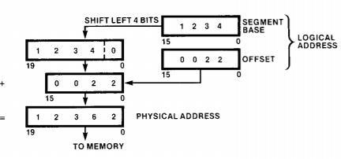
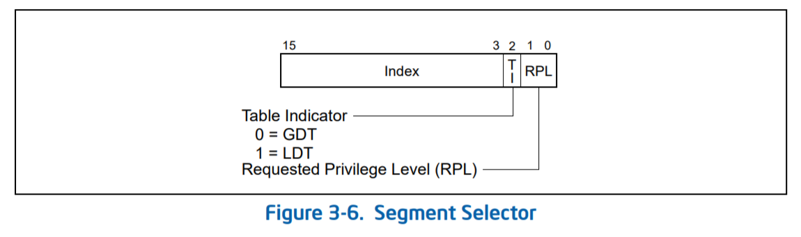

# Chpater 3. 프로세서 아키텍처

## 3.1 386 아키텍처

해당 챕터에서는 386 아키텍처에 대해서 다룰 것이다. 도입부에서 얘기했듯이 아키텍처의 모든 부분을 설명하지는 않고,  관련된 내용만 기술한다. 추가적인 부분은 아키텍쳐 매뉴얼을 참고하면 된다.  레지스터 세트, 명령어 세트 등과 같은 기본적인 것에 대한 설명을 피하고 0.01 코드 이해와 관련된 내용만 소개한다.

### 3.1.1 Segmentation in 386

**8086 모드**에서는 물리 메모리 공간은  64KB 크기의 세그먼트라는 논리적 메모리 공간으로 분리 된다. CPU는 4개의 세그먼트에 대해 직접적인 접근이 가능하다. 세그먼트들이 표현하는 영역은 겹쳐질 수도 있고 겹치지 않을 수  있다. 아래 그림은 각각의 세그먼트가 차지하고 있는 물리 주소 영역을 보여준다.

* CS\(code segment\)는 현재 코드 세그먼트의 베이스 주소를 저장한다. \(Instruction fetch될 때 코드 세그먼트를 사용해서 얻은 물리 주소의 인스트럭션을 읽어들인다.\)
* DS\(data segment\)는 현재 데이터 세그먼트 주소를 저장한다. 
* ES\(extra segment\)는 추가적인 세그먼트의 베이스 주소를 저장한다. 
* SS\(stack segment\)는 현재 스텍 세그먼트의 베이스 주소를 저장한다.

8086 모드에서는 두 개의 주소 영역\[논리적 주소\(Logical address\), 물리 주소\(Physical address\)\]가 있다고 생각하면 편하다. 물리적 주소는 최대 1MB까지 표현이 되고, 논리적 주소는 세그먼트의 주소 공간에 대응하므로 64KB까지 표현이 된다. 물리적 주소는 세그먼트 레지스터의 값을 16만큼 더하고, offset을 더하는 것으로 변환된다. 

위의 예시를 살펴보자. 접근하려는 논리적 주소는 0x0022이고 선택된 세그먼트의 베이스 어드레스는 0x1234와 같다 따라서 PHYSICAL\_ADDRESS = \(BASE\_ADDRESS &lt;&lt; 4\) + OFFSET과 같이 계산이 되어 0x12362의 주소로 변환된다.

**386 모드**에서는 세그먼트 레지스터는 8086모드에서와는 다르게 사용되고 이름도 세그먼트 셀렉터라고 불린다. 이름대로 세그먼트 셀렉터는 세그먼트 디스크립터 테이블의 한 엔트리를 가르킨다.

* Index : \[15:3\] 세그먼트 디스크립터 테이블의 인덱스를 의미한다. 
* Table Indicator: GDT\(Global Descriptor Table\)를 사용할지 LDT\(Local Descriptor Table\)을 사용할지 결정한다.
* Requested Privilege Level: 현재 프로세스/태스크의특권 레벨를 저장한다.\(\*매뉴얼의 Privilege 항목 참고\)

논리 주소가 선형 주소\(linear address\)로 변환되는 과정은 다음과 같다.

* 사용될 세그먼트 디스크립터를 세그먼트 셀렉터를 사용해서 고른다.
* 세그먼트 디스크립터의 접근할 권한이 있는지 확인하고 오프셋이 세그먼트의 디스크립터의 리미트를 벗어나는지 확인한다.
* 세그먼트 디스크립터의 베이스 어드레스와 오프셋을 더하여 선형 주소으로 변환한다.

#### 3.1.1.1 디스크립터 테이블

위의 내용을 잘 따라 왔다면 "프로세서는 세그먼트 디스크립터 테이블의 위치는 어떻게 알지?"라는 질문을 떠올리게 될 것이다. 세그먼트 디스크립터 테이블의 주소를 위한 특별한 레지스터들이 존재하고, GDTR\(gdt 레지스터\)는 GDT 자료 구조의 위치를 LDTR은 LDT 자료 구조의 위치를 저장한다. LGDT/LLDT , SGDT/SLDT 인스트럭션들은 프로세서가 세그먼트 디스크립터의 주소를 레지스터에 load, save하도록 한다.

#### 3.1.1.2 GDT/LDT 디스크립터 포맷

아래 그림은 모든 디스크립터에 대해, 일반적인 디스크립터 포맷을 보여준다.

* Segment Limit: 세그먼트의 크기 정보를 담는다. 해당 제한을 벗어난 오프셋에 대한 접근은 exception을 발생한다.
  * Granularity가 0이라면 기본 단위는 1B이다 
  * Granularity가 1이라면 기본 단위는 4KB이다.
  * ex\) limit = 0x0022 일때
    * Granularity=0 이라면, 세그먼트의 사이즈는 22바이트이다. 
    * Granularity=1 이라면, 세그먼트의 사이즈는 88킬로바이트이다.
* Base address fields: 0부터 4GB까지 세그먼트의 베이스 주소를 저장한다.
* Type: 해당 디스크립터가 Read/Write/Executable/Expand 속성을 저장한다. 

